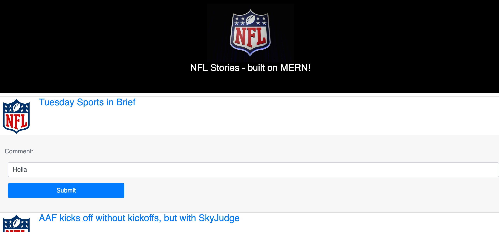

# Scrape it!

 

### The App

https://scrapeit-all.herokuapp.com/

### Leveraged a generator for this framework:
https://medium.com/@fabianopb/fullstack-express-react-app-with-typescript-5a103e19821e

NPM package: create-mern-ts-app

^ This taught me a ton of what to do and what **not** to do. Good introduction to some of the concepts we picked up recently in class, but there's a lot of things I'll alter going forward in other assignments.

### New items I learned:
- TypeScript: Continued to use it, and pulled it into the frontend this time around.
- React: Pulled it in to this assignment... learn by doing!
- Jest: Only did the user, not the NFL model (need to get better at doing it all).
- Travis.ci added
- Coveralls added

### License

MIT
